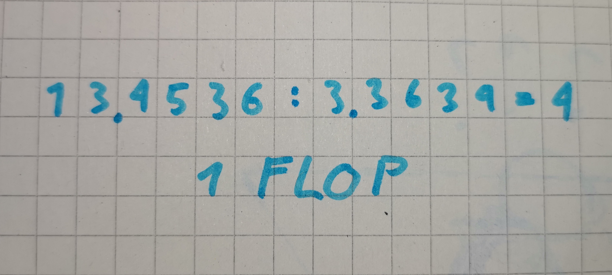

# The more FLOPS the better
FLOPS is a performance measurement indicating how many **fl**oating point **op**erations can be calculated in a **s**econd. It is used to measure the performance of computers and their processors. A floating point operation describes a mathematical procedure using decimal numbers. Despite the human brain being immensely powerful its capabilities when doing decimal calculations is limited. It is estimated at around 0.01 FLOPS, roughly 1 calculation every 100 seconds. In comparison, a modern smartphone has about 10¹² FLOPS (1 Teraflop), while the fastest super computer has around 100\*10¹⁵ FLOPS (100 Petaflops). Historically, the power of processors has been increasing exponentially (according to Moore's Law).

## Notes

Should possibly be after Moors Law.
Could reference the fact that the human brain can do around 10²² FLOPS if we search for its real performance.
Potentially talk about price differences between equally powerful cpus then and now.

## Author

ns & ls, 05.03.2019
